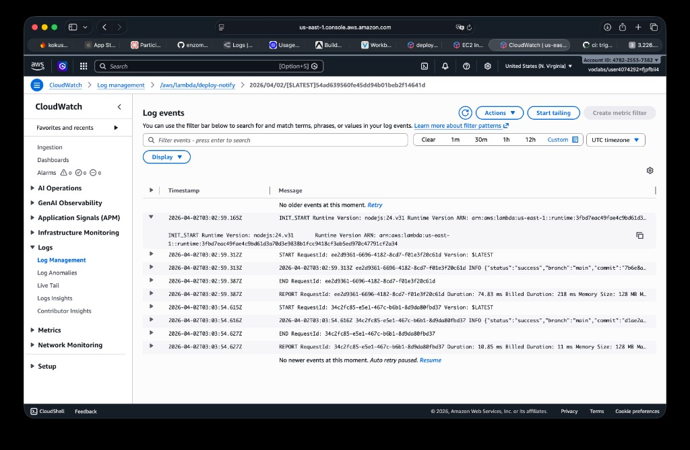

# DevOps Exercise 3 — Submission

<!-- Regenerate PDF: `.venv-submission/bin/python scripts/build_submission_pdf.py` -->

## 1. GitHub repository

- **Repository:** [https://github.com/ezgna/snapcart-raw](https://github.com/ezgna/snapcart-raw)
- **Sample successful workflow run:** [https://github.com/ezgna/snapcart-raw/actions/runs/23881622451](https://github.com/ezgna/snapcart-raw/actions/runs/23881622451)

## 2. Lambda function URL

[https://egzko6oawbtxj3kzlowc6452vu0bnizz.lambda-url.us-east-1.on.aws/](https://egzko6oawbtxj3kzlowc6452vu0bnizz.lambda-url.us-east-1.on.aws/)

## 3. Amazon CloudWatch log (screenshot)

The log stream shows invocations of the `deploy-notify` function after deployment, including JSON fields such as `status`, `branch`, `commit`, and `timestamp`.

## 4. What the Lambda logs and why it helps

After each EC2 deployment, GitHub Actions sends a small JSON payload to this Lambda (success or failure, branch name, commit hash, timestamp, and workflow metadata). The function writes that information to Amazon CloudWatch Logs so we can see *when* a deployment happened and *what* code shipped. That makes it easier to audit releases, debug failures, and later plug in alerts or dashboards without changing the app itself.
